# wisnuc´ò°üÃüÁî

## °²×°git£ºsudo apt install git
 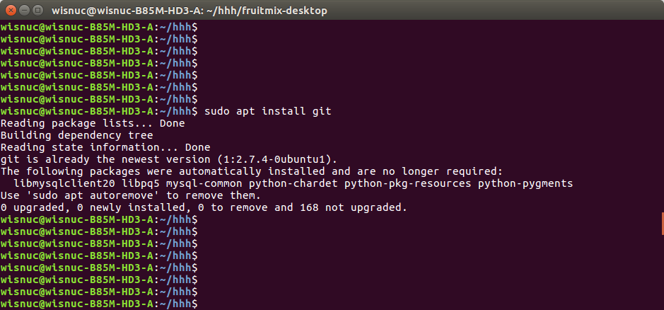

## ¿Ë¡´úÂ룺git clone https://www.github.com/wisnuc/fruitmix-desktop.git
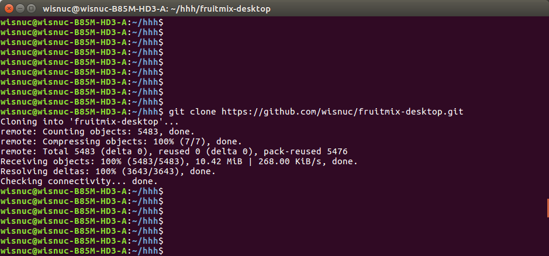

## ÇĞ»»µ½´úÂëĿ¼²é¿´£ºcd fruitmix-desktop

## ÇĞ»»·ÖÖ§£ºgit checkout transimission
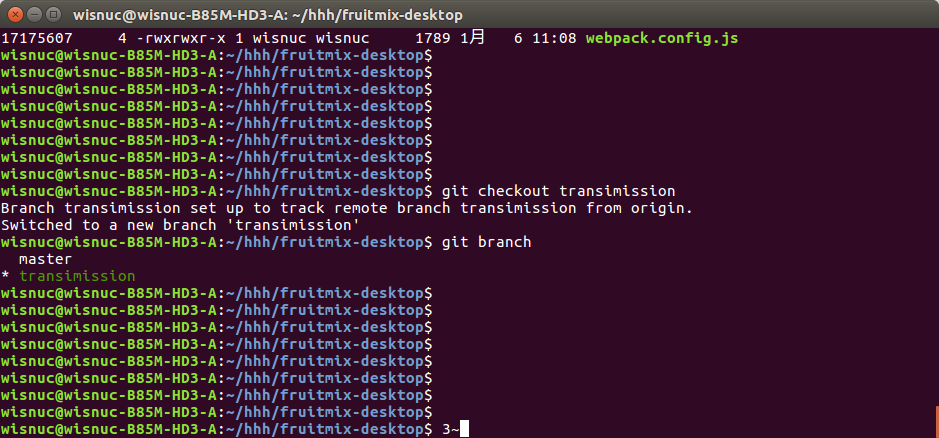

## °²×°ÒÀÀµ°ü£º  npm install £¨È«¾ÖÇé¿öÏ°²×°ÒÀÀµ°ü£º  npm install ¨Cg£©
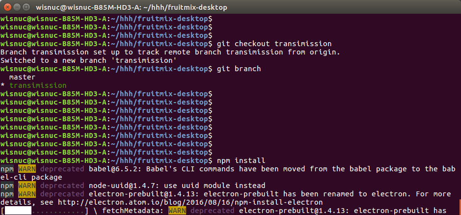

## Ç°¶Ë½øĞĞ´ò°ü£º   node_modules/.bin/webpack --watch --watch-poll
##£¨È«¾ÖÇé¿öÏÂÇ°¶Ë½øĞĞ´ò°ü£ºwebpack£©
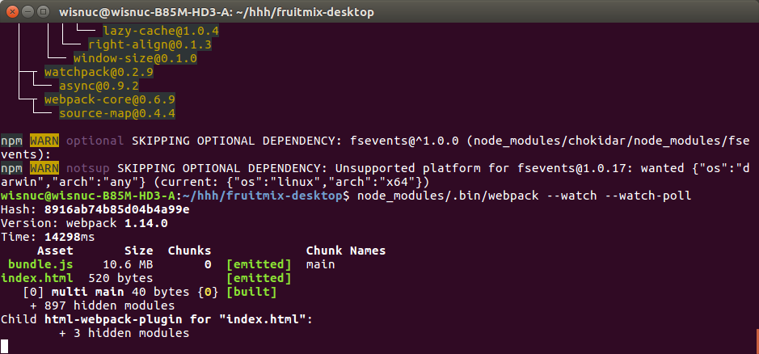

## Fruitmix-desktopÈ¥ÔÓ£¬Ëõ¼õ´¢´æÕ¼ÓÃ
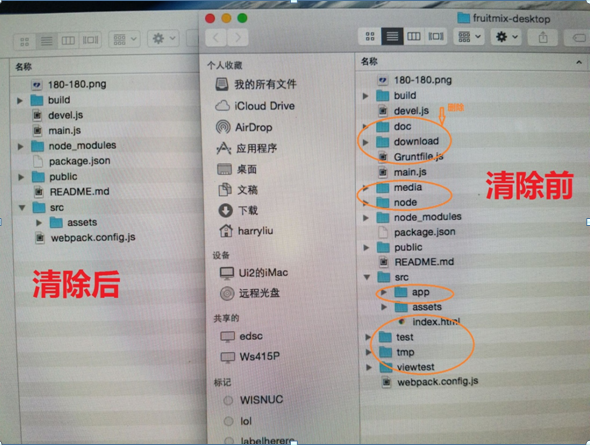

## ½«es6Óï·¨±àÒëΪä¯ÀÀÆ÷Ö§³ÖµÄes5£º npm run build
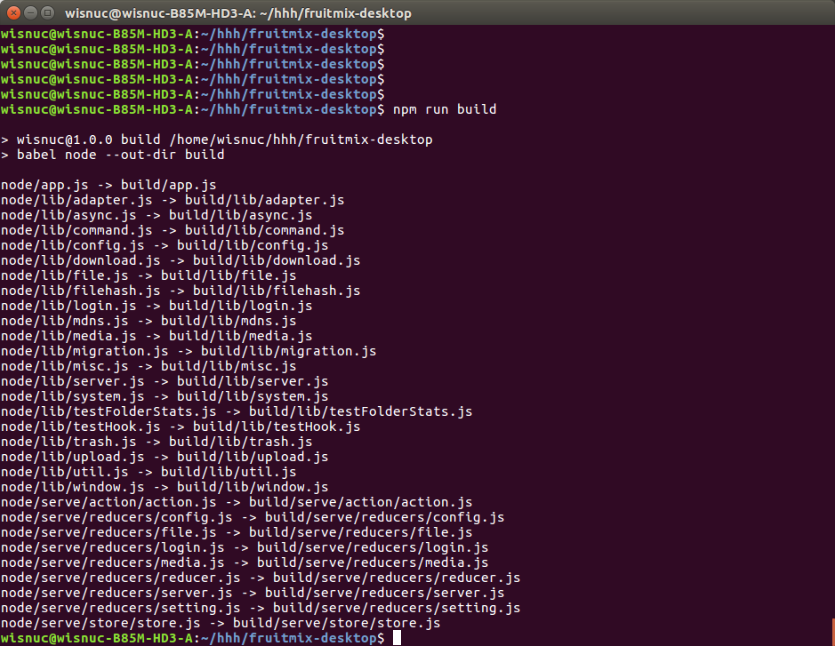

## È¥³ınode_modulesÔÓÓàÎļş£º   npm prune ¨Cproduction
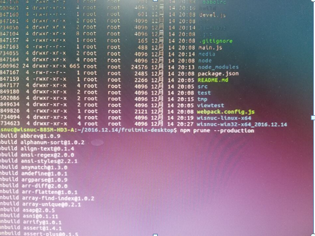

## ²éѯ´ò°ü»ù´¡ÃüÁ node_modules/.bin/electron-packager ¨Chelp
##£¨È«¾Öʱ²éѯÃüÁ          electron-packager ¨Chelp£©
## ÕÒµ½archºÍplatformµÄ¶ÔÓ¦Öµ¡£
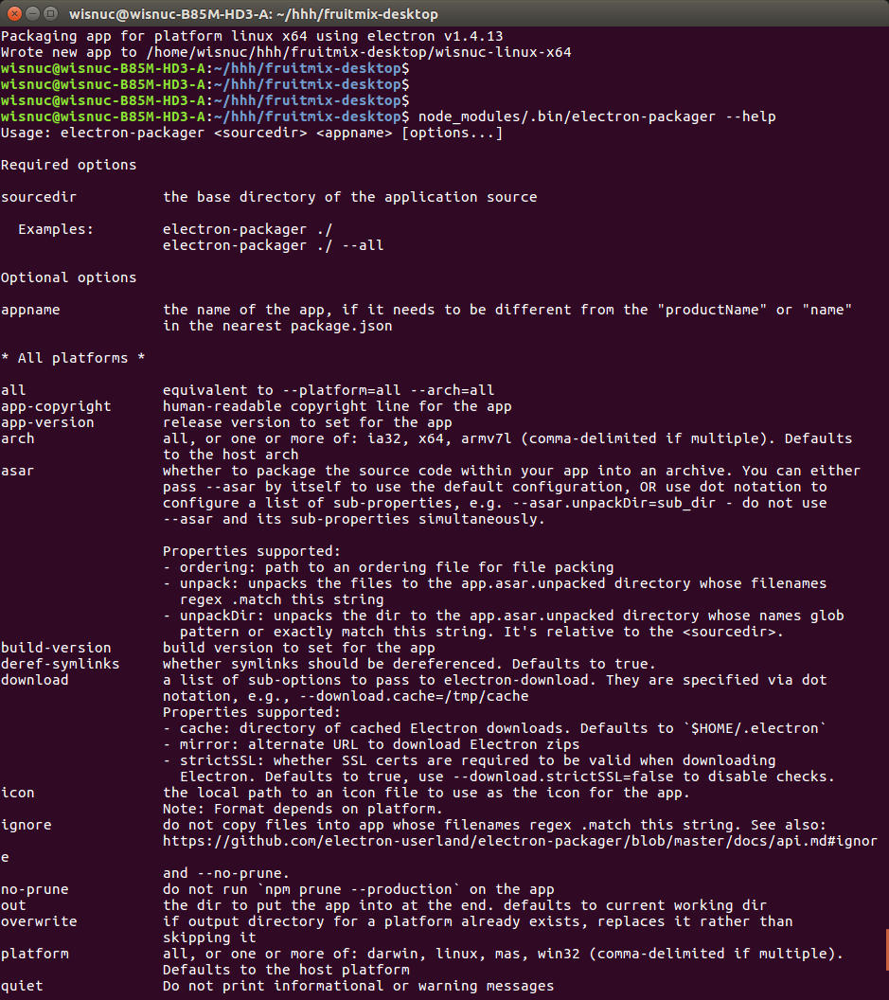

## linux´ò°ü£º     node_modules/.bin/electron-packager . --no-prune --arch=x64 --platform=linux
##£¨È«¾Öʱ´ò°üÃüÁ          electron-packager . --no-prune --arch=x64 --platform=linux£©
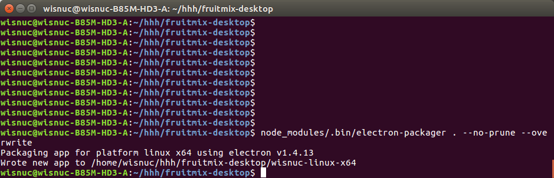

## windows´ò°ü£º

#£¨1£©.°²×°windowsÒÀÀµ°ü£º
# sudo apt install wine

# sudo dpkg --configure ¨Ca

# sudo apt install wine
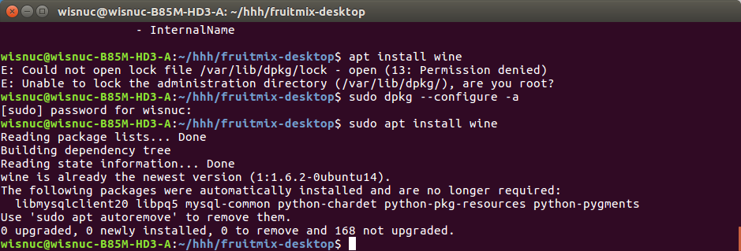

#£¨2£©.windows64λ½øĞĞ´ò°ü£º node_modules/.bin/electron-packager . --no-prune --arch=x64 --platform=win32

# Windows32λ½øĞĞ´ò°ü£º  node_modules/.bin/electron-packager . --no-prune --arch=ia32 --platform=win32

# £¨È«¾Öʱ´ò°üÃüÁ          electron-packager . --no-prune --arch=x64 --platform=win32£©
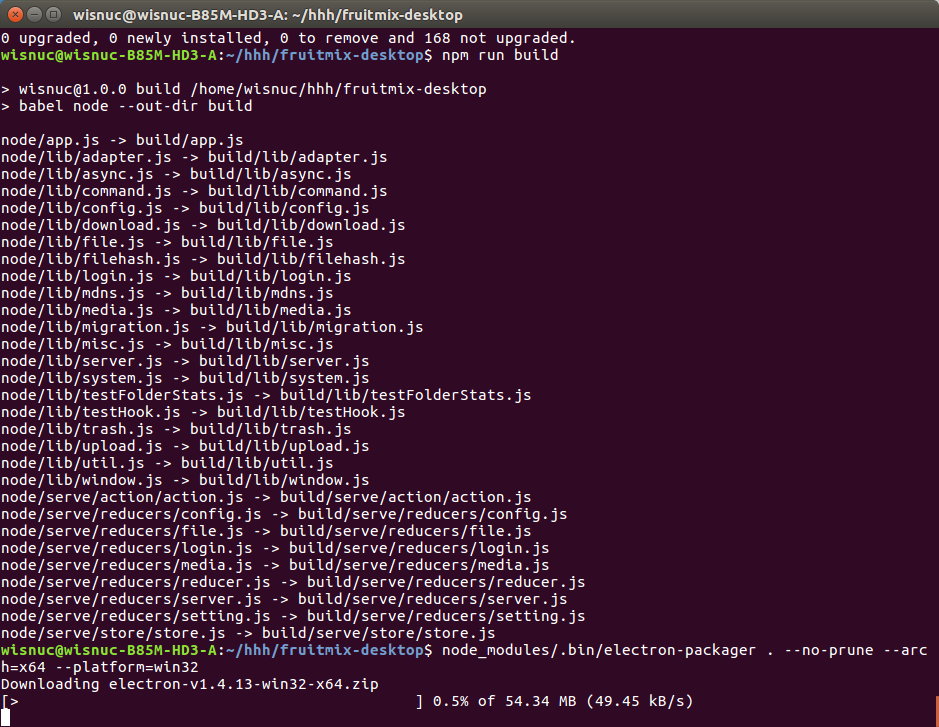

## mac´ò°ü£º  node_modules/.bin/electron-packager . --no-prune --arch=x64 --platform= darwin
## £¨È«¾Öʱmac´ò°üÃüÁ          electron-packager . --no-prune --arch=x64 --platform=darwin£©

Íê±Ï¡£

