# wisnuc打包命令

## 安装git：sudo apt install git
 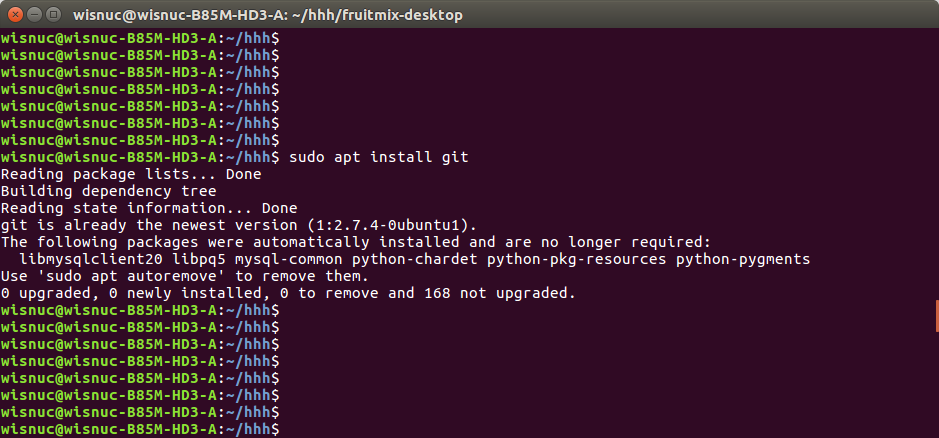

## 克隆代码：git clone https://www.github.com/wisnuc/fruitmix-desktop.git
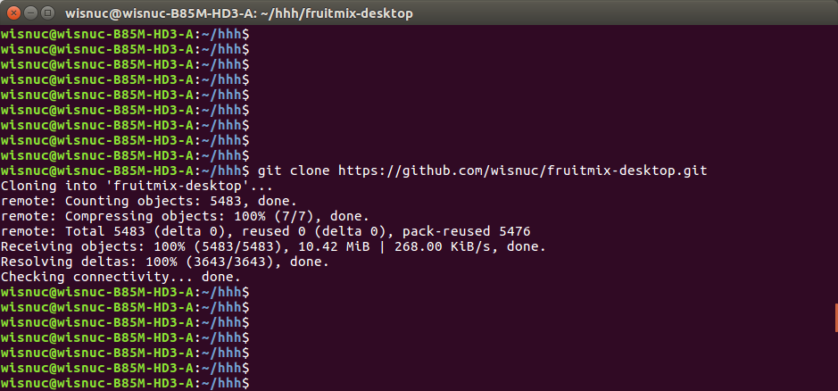

## 切换到代码目录查看：cd fruitmix-desktop
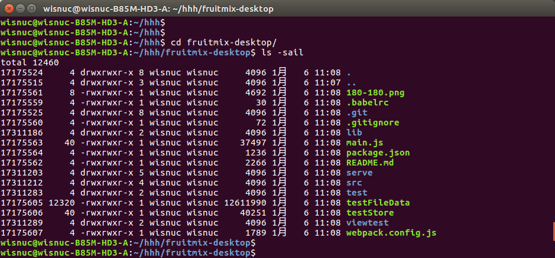

## 切换分支：git checkout transimission
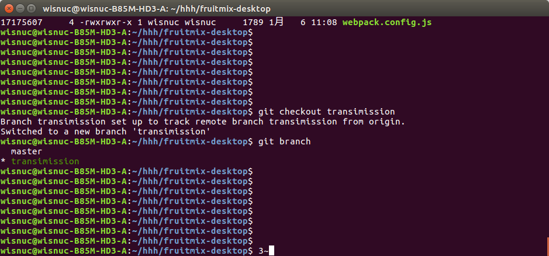

## 安装依赖包：  npm install （全局情况下安装依赖包：  npm install Cg）
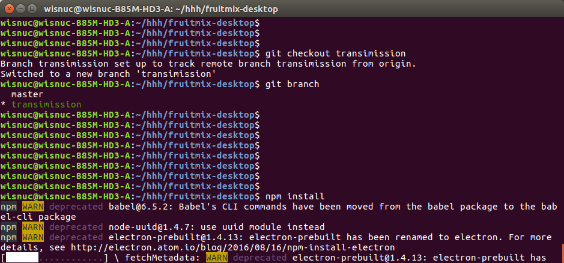

## 前端进行打包：   node_modules/.bin/webpack --watch --watch-poll
##（全局情况下前端进行打包：webpack）
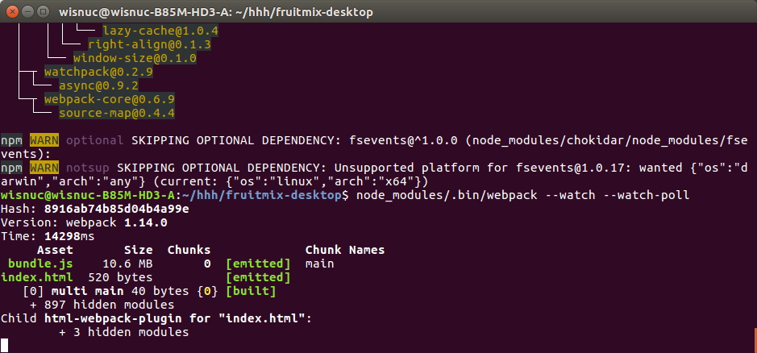

## Fruitmix-desktop去杂，缩减储存占用
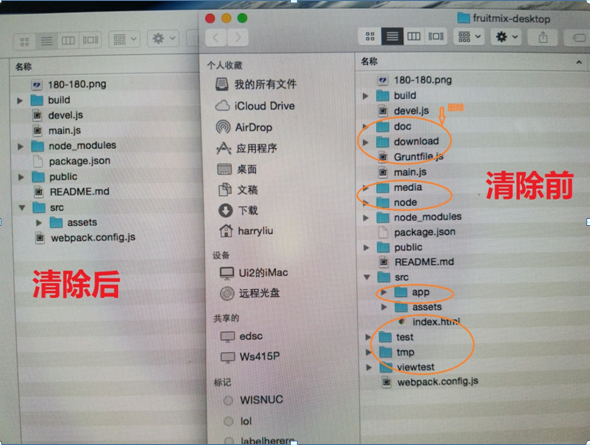

## 将es6语法编译为浏览器支持的es5： npm run build
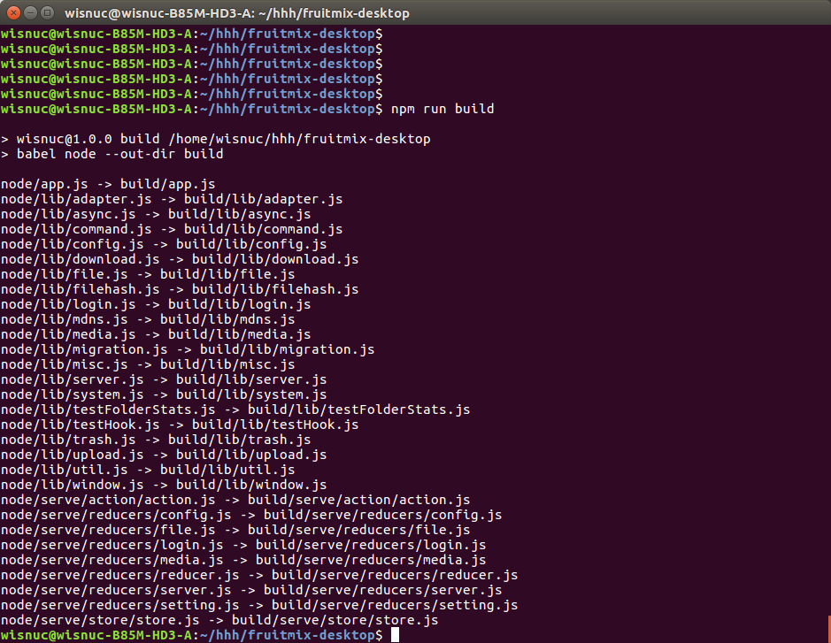

## 去除node_modules杂余文件：   npm prune Cproduction
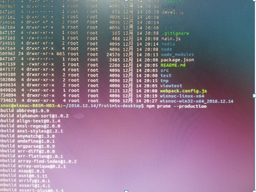

## 查询打包基础命令： node_modules/.bin/electron-packager Chelp
##（全局时查询命令：          electron-packager Chelp）
## 找到arch和platform的对应值。
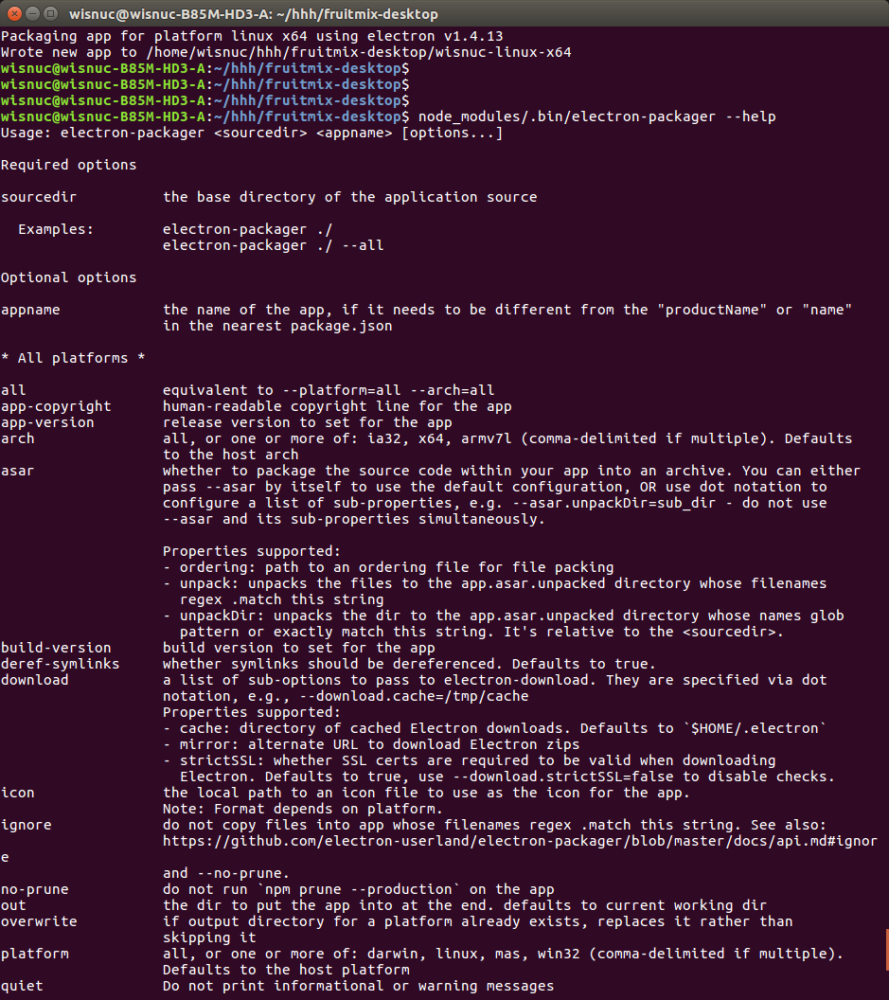

## linux打包：     node_modules/.bin/electron-packager . --no-prune --arch=x64 --platform=linux
##（全局时打包命令：          electron-packager . --no-prune --arch=x64 --platform=linux）
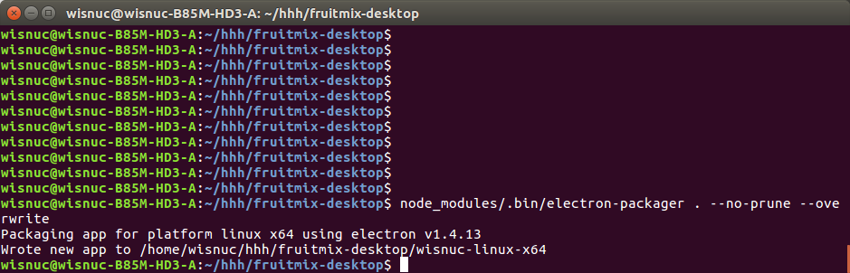

## windows打包：

### （1）.安装windows依赖包：
### sudo apt install wine

### sudo dpkg --configure Ca

### sudo apt install wine
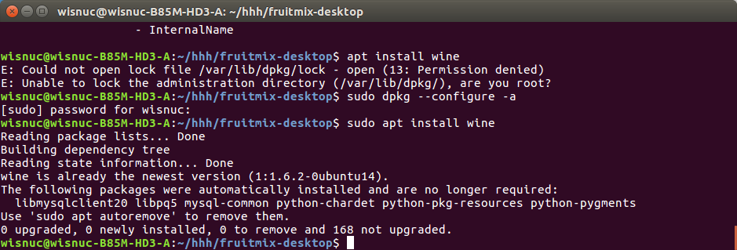

## （2）.windows64位进行打包： node_modules/.bin/electron-packager . --no-prune --arch=x64 --platform=win32

## Windows32位进行打包：  node_modules/.bin/electron-packager . --no-prune --arch=ia32 --platform=win32

## （全局时打包命令：          electron-packager . --no-prune --arch=x64 --platform=win32）
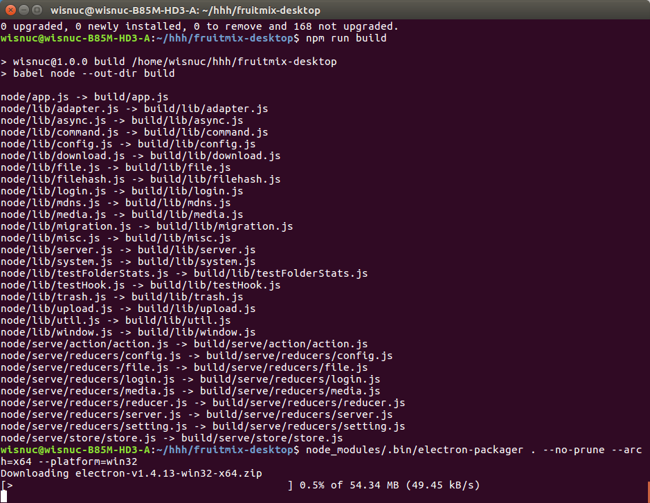

## mac打包：  node_modules/.bin/electron-packager . --no-prune --arch=x64 --platform= darwin
## （全局时mac打包命令：          electron-packager . --no-prune --arch=x64 --platform=darwin）

完毕。

